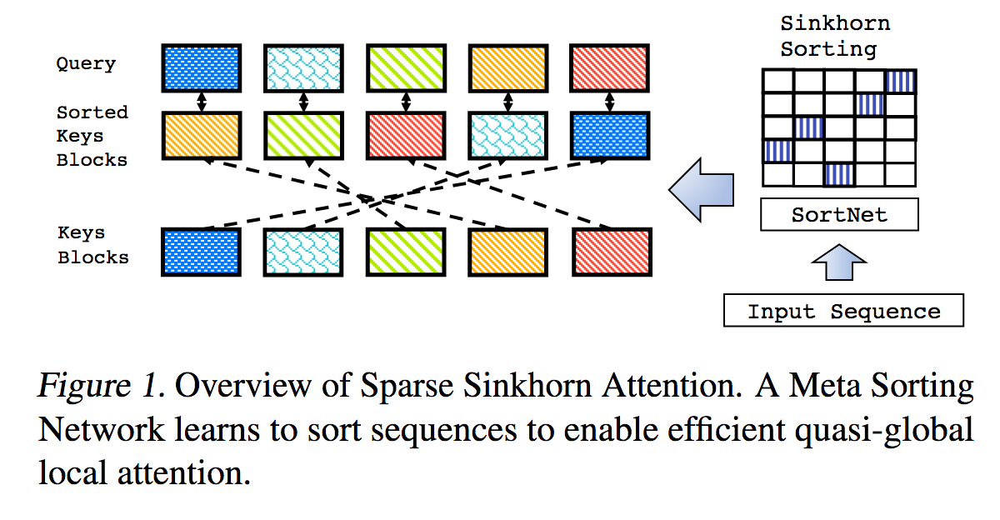
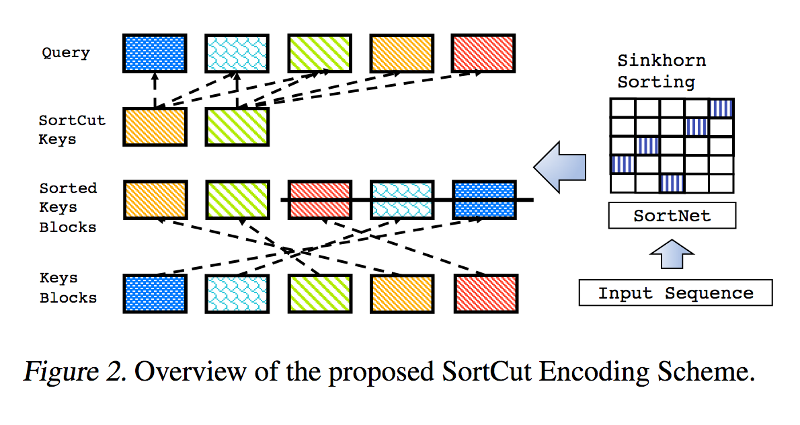
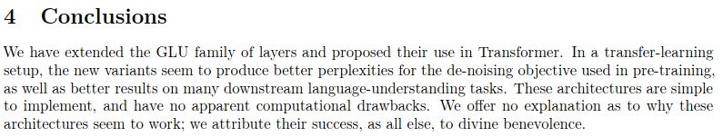

## Sinkhorn Transformer

[](https://badge.fury.io/py/sinkhorn-transformer)





---

This is a reproduction of the work outlined in <a href="https://arxiv.org/abs/2002.11296">Sparse Sinkhorn Attention</a>, with additional enhancements.

It includes a parameterized sorting network, using sinkhorn normalization to sample a permutation matrix that matches the most relevant buckets of keys to the buckets of queries.

This work also brings in reversible networks and feed forward chunking (concepts introduced from <a href="https://openreview.net/forum?id=rkgNKkHtvB">Reformer</a>) to bring about further memory savings.

[](https://colab.research.google.com/drive/1Eej8U4pP5ldZOz3tHwpoBFgmQqLhQLUq) 204k tokens (demonstration purposes)

## Install

```bash
$ pip install sinkhorn_transformer
```

## Use

A Sinkhorn Transformer based language model

```python
import torch
from sinkhorn_transformer import SinkhornTransformerLM

model = SinkhornTransformerLM(
    num_tokens = 20000,
    dim = 1024,
    heads = 8,
    depth = 12,
    max_seq_len = 8192,
    bucket_size = 128,        # size of the buckets
    causal = False,           # auto-regressive or not
    n_sortcut = 2,            # use sortcut to reduce memory complexity to linear
    n_top_buckets = 2,        # sort specified number of key/value buckets to one query bucket. paper is at 1, defaults to 2
    ff_chunks = 10,           # feedforward chunking, from Reformer paper
    reversible = True,        # make network reversible, from Reformer paper
    emb_dropout = 0.1,        # embedding dropout
    ff_dropout = 0.1,         # feedforward dropout
    attn_dropout = 0.1,       # post attention dropout
    attn_layer_dropout = 0.1, # post attention layer dropout
    layer_dropout = 0.1,      # add layer dropout, from 'Reducing Transformer Depth on Demand' paper
    weight_tie = True,        # tie layer parameters, from Albert paper
    emb_dim = 128,            # embedding factorization, from Albert paper
    dim_head = 64,            # be able to fix the dimension of each head, making it independent of the embedding dimension and the number of heads
    ff_glu = True,            # use GLU in feedforward, from paper 'GLU Variants Improve Transformer'
    n_local_attn_heads = 2,   # replace N heads with local attention, suggested to work well from Routing Transformer paper
    pkm_layers = (4,7),       # specify layers to use product key memory. paper shows 1 or 2 modules near the middle of the transformer is best
    pkm_num_keys = 128,       # defaults to 128, but can be increased to 256 or 512 as memory allows
)

x = torch.randint(0, 20000, (1, 2048))
model(x) # (1, 2048, 20000)
```

A plain Sinkhorn Transformer, layers of sinkhorn attention

```python
import torch
from sinkhorn_transformer import SinkhornTransformer

model = SinkhornTransformer(
    dim = 1024,
    heads = 8,
    depth = 12,
    bucket_size = 128
)

x = torch.randn(1, 2048, 1024)
model(x) # (1, 2048, 1024)
```

Sinkhorn Encoder / Decoder Transformer

```python
import torch
from sinkhorn_transformer import SinkhornTransformerLM

DE_SEQ_LEN = 4096
EN_SEQ_LEN = 4096

enc = SinkhornTransformerLM(
    num_tokens = 20000,
    dim = 512,
    depth = 6,
    heads = 8,
    bucket_size = 128,
    max_seq_len = DE_SEQ_LEN,
    reversible = True,
    return_embeddings = True
).cuda()

dec = SinkhornTransformerLM(
    num_tokens = 20000,
    dim = 512,
    depth = 6,
    causal = True,
    bucket_size = 128,
    max_seq_len = EN_SEQ_LEN,
    receives_context = True,
    context_bucket_size = 128,  # context key / values can be bucketed differently
    reversible = True
).cuda()

x = torch.randint(0, 20000, (1, DE_SEQ_LEN)).cuda()
y = torch.randint(0, 20000, (1, EN_SEQ_LEN)).cuda()

x_mask = torch.ones_like(x).bool().cuda()
y_mask = torch.ones_like(y).bool().cuda()

context = enc(x, input_mask=x_mask)
dec(y, context=context, input_mask=y_mask, context_mask=x_mask) # (1, 4096, 20000)
```

## Autopadder

By default the model will complain if given an input that is not a multiple of the bucket size. To avoid having to make the same padding calculations each time, you can use the helper `Autopadder` class. It will take care of the `input_mask` for you as well, if given. Contextual key/values and mask are supported as well.

```python
import torch
from sinkhorn_transformer import SinkhornTransformerLM
from sinkhorn_transformer import Autopadder

model = SinkhornTransformerLM(
    num_tokens = 20000,
    dim = 1024,
    heads = 8,
    depth = 12,
    max_seq_len = 2048,
    bucket_size = 128,
    causal = True
)

model = Autopadder(model, pad_left=True) # autopadder will fetch the bucket size and autopad input

x = torch.randint(0, 20000, (1, 1117)) # odd sequence length
model(x) # (1, 1117, 20000)
```

## Sinkhorn

This repository has diverged from the paper and is now using attention in place of the original sorting net + gumbel sinkhorn sampling. I have not found a noticeable difference in performance yet, and the new scheme allows me to generalize the network to flexible sequence lengths. If you would like to try Sinkhorn, please use the following settings, which only works for non-causal networks.

```python
import torch
from sinkhorn_transformer import SinkhornTransformerLM

model = SinkhornTransformerLM(
    num_tokens = 20000,
    dim = 1024,
    heads = 8,
    depth = 12,
    bucket_size = 128,
    max_seq_len = 8192,
    use_simple_sort_net = True, # turn off attention sort net
    sinkhorn_iter = 7,          # number of sinkhorn iterations - default is set at reported best in paper
    n_sortcut = 2,              # use sortcut to reduce complexity to linear time
    temperature = 0.75,         # gumbel temperature - default is set at reported best in paper
    non_permutative = False,    # allow buckets of keys to be sorted to queries more than once
)

x = torch.randint(0, 20000, (1, 8192))
model(x) # (1, 8192, 20000)
```

## Product Key Memory

To see the benefits of using PKM, the learning rate of the values must be set higher than the rest of the parameters. (Recommended to be `1e-2`)

You can follow the instructions here to set it correctly https://github.com/lucidrains/product-key-memory#learning-rates

## Issues

### Decoding and sequence lengths

Sinkhorn, when trained on fixed length sequences, seems to have trouble decoding sequences from scratch, mainly due to the fact that the sorting net has trouble generalizing when the buckets are partially filled with padding tokens.

Fortunately, I think I have found a simple solution. During training, for causal networks, randomly truncate the sequences and force the sorting net to generalize. I have provided a flag (`randomly_truncate_sequence`) for the `AutoregressiveWrapper` instance to make this easy.


```python
import torch
from sinkhorn_transformer import SinkhornTransformerLM, AutoregressiveWrapper

model = SinkhornTransformerLM(
    num_tokens = 20000,
    dim = 1024,
    heads = 8,
    depth = 12,
    bucket_size = 75,
    max_seq_len = 8192,
    causal = True
)

model = AutoregressiveWrapper(model)

x = torch.randint(0, 20000, (1, 8192))
loss = model(x, return_loss = True, randomly_truncate_sequence = True) # (1, 8192, 20000)
```

I am open to suggestions if someone has found a better solution.

### Causal sorting net

There is a potential problem with the causal sorting network, where the decision of which key/value buckets of the past sorts to a bucket is dependent only on the first token and not the rest (due to the bucketing scheme and preventing leakage of future to past).

I have attempted to alleviate this problem by rotating half the heads to the left by bucket size - 1, thereby promoting the last token to be first. This is also the reason why the `AutoregressiveWrapper` defaults to left padding during training, to always make sure that the last token in the sequence have a say in what to retrieve.

If anyone has found a cleaner solution, please let me know in the issues.

## Alternatives

1. Routing Transformer - https://github.com/lucidrains/routing-transformer
2. Reformer - https://github.com/lucidrains/reformer-pytorch

## Citations

```bibtex
@misc{tay2020sparse,
    title   = {Sparse Sinkhorn Attention},
    author  = {Yi Tay and Dara Bahri and Liu Yang and Donald Metzler and Da-Cheng Juan},
    year    = {2020},
    url.    = {https://arxiv.org/abs/2002.11296}
}
```

```bibtex
@inproceedings{kitaev2020reformer,
    title       = {Reformer: The Efficient Transformer},
    author      = {Nikita Kitaev and Lukasz Kaiser and Anselm Levskaya},
    booktitle   = {International Conference on Learning Representations},
    year        = {2020},
    url         = {https://openreview.net/forum?id=rkgNKkHtvB}
}
```

```bibtex
@misc{lan2019albert,
    title       = {ALBERT: A Lite BERT for Self-supervised Learning of Language Representations},
    author      = {Zhenzhong Lan and Mingda Chen and Sebastian Goodman and Kevin Gimpel and Piyush Sharma and Radu Soricut},
    year        = {2019},
    url         = {https://arxiv.org/abs/1909.11942}
}
```

```bibtex
@misc{shazeer2020glu,
    title   = {GLU Variants Improve Transformer},
    author  = {Noam Shazeer},
    year    = {2020},
    url     = {https://arxiv.org/abs/2002.05202}
}
```

```bibtex
@misc{roy*2020efficient,
    title   = {Efficient Content-Based Sparse Attention with Routing Transformers},
    author  = {Aurko Roy* and Mohammad Taghi Saffar* and David Grangier and Ashish Vaswani},
    year    = {2020},
    url     = {https://openreview.net/forum?id=B1gjs6EtDr}
}
```

```bibtex
@inproceedings{fan2020reducing,
    title     ={Reducing Transformer Depth on Demand with Structured Dropout},
    author    ={Angela Fan and Edouard Grave and Armand Joulin},
    booktitle ={International Conference on Learning Representations},
    year      ={2020},
    url       ={https://openreview.net/forum?id=SylO2yStDr}
}
```

```bibtex
@misc{lample2019large,
    title   = {Large Memory Layers with Product Keys},
    author  = {Guillaume Lample and Alexandre Sablayrolles and Marc'Aurelio Ranzato and Ludovic Denoyer and Hervé Jégou},
    year    = {2019},
    eprint  = {1907.05242},
    archivePrefix = {arXiv}
}
```

```bibtex
@misc{bhojanapalli2020lowrank,
    title   = {Low-Rank Bottleneck in Multi-head Attention Models},
    author  = {Srinadh Bhojanapalli and Chulhee Yun and Ankit Singh Rawat and Sashank J. Reddi and Sanjiv Kumar},
    year    = {2020},
    eprint  = {2002.07028}
}
```

</img>